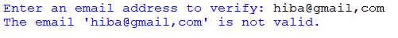
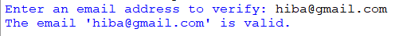

## Description
This program utilizes regular expressions to validate whether a given email address conforms to the standard pattern. It prompts the user to input an email address and then checks whether the provided email address is valid or not based on the defined pattern. The program provides feedback to the user indicating whether the email address entered is valid or invalid.
## Example
♡ Example 1 : 

  

♡ Example 2 :  

